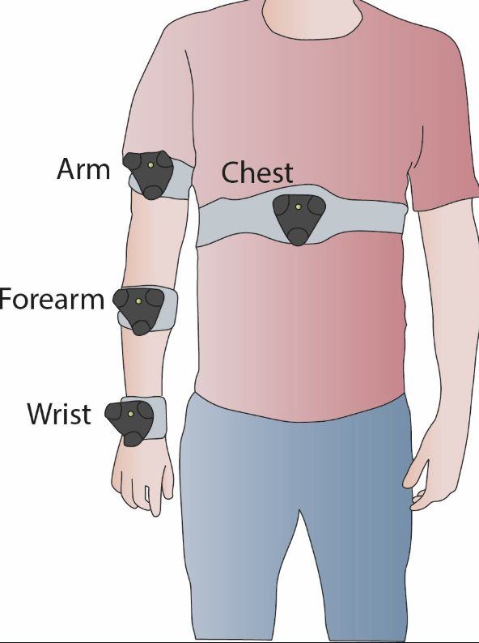

# Body Kinematic Null Space

Open-source MATLAB code for calibrating and computing a control signal extracted from upper-body kinematic null space.

This work is part of a study on using body redundancy to control extra degrees of freedom. The paper can be read here: [Rossato and Brogi et al., 2026](https://ieeexplore.ieee.org/document/11558524)

## Hardware Setup

Use four [HTC Vive Tracker 3.0](https://www.vive.com/eu/accessory/tracker3/) and two [HTC Base Station](https://www.vive.com/eu/accessory/base-station/).

The tracker placement is shown below:

<p align="center">
   
</p>

Trackers should be positioned as in the figure, with the green LED facing upward.

## Repository Structure

- `mainCalibration_AUTO.m`: calibration pipeline that acquires or loads tracker data, detects calibration clusters, computes local PCA models, and saves kernel parameters.
- `onlineKernelRepeater.m`: online runtime that reads live tracker packets, evaluates the calibrated kernel signal, and updates a normalized control value in real time.
- `functions/`: helper functions used by the two scripts (packet unpacking, clustering, interpolation, PCA sign handling, plotting interactions).

## Data Format

Incoming UDP packets are unpacked as:

`[timestamp] [numTrackers] [P1] [Q1] ... [Pn] [Qn]`

where $P_n$ is tracker $n$ position and $Q_n$ is tracker $n$ quaternion.

The packets can be delivered from the codes in the repo [HTC Tracker Python](https://github.com/BernardoBrogi/HTCTracker-python)

## Workflow

Run the two scripts in this order:

1. `mainCalibration_AUTO.m`
2. `onlineKernelRepeater.m`

### 1) Calibration Script (`mainCalibration_AUTO.m`)

What it does:

1. Opens UDP on local port `8051` and collects tracker packets until you close the stop dialog.
2. Stores raw calibration data (`tracker_data`) and optionally saves it in `Test/<subject>_<timestamp>.mat`.
3. Filters to valid samples with four active trackers.
4. Computes relative rotations between trackers.
5. Transforms positions into chest reference frame.
6. Runs interactive clustering (`dataClustering_dragDrop`) to identify calibration points.
7. Computes a PCA model per cluster and derives min/max normalization values.
8. Saves calibration output to `pcaClusteredValues.mat`.

Main output file:

- `pcaClusteredValues.mat` containing:
  - `kernel_coordinates`
  - `kernel_coeff_values`
  - `mu_all`
  - `kernel_max_values`
  - `kernel_min_values`
  - `not_moving_hand`

Important note:

The script currently includes a fixed `load calib_example.mat` before processing. Replace that line with your own `.mat` file (or comment it if you want to process the just-acquired `tracker_data` from the same run).

### 2) Online Script (`onlineKernelRepeater.m`)

What it does:

1. Loads `pcaClusteredValues.mat` produced by the calibration step.
2. Opens UDP on local port `8051` and reads live tracker packets.
3. Re-expresses data in chest frame and computes relative quaternion features.
4. Interpolates local PCA parameters from nearest calibration kernels.
5. Computes normalized kernel value.
6. Integrates kernel increments into `controlValue`, clamps it to $[0, 1]$, and plots it live.
7. Lets you flip the control direction with the `Change Sign` button.

Runtime behavior:

- `controlValue` is the final normalized output signal.
- The loop runs until you close the `Stop DataStream` dialog.

## Typical Usage Example

1. Start tracker streaming to UDP port `8051`.
2. Run `mainCalibration_AUTO.m` and perform the calibration movement.
3. Confirm/adjust centroids when prompted.
4. Verify that `pcaClusteredValues.mat` is created.
5. Run `onlineKernelRepeater.m`.
6. Observe live signal evolution and use `Change Sign` if needed.

## Example Acquisition Video

In this [video](https://youtu.be/1KZRV8W0jXI) an example of the procedure to compute calibration and online control.


## Cite Us!

If you found this work useful for developing your own research, please consider citing us using the following BibTeX entry:
```bibtex
@article{rossato2026hybrid,
  author={Rossato, Julien and Brogi, Bernardo and Baldi, Tommaso Lisini and Hinnekens, Elodie and Prattichizzo, Domenico and D’Avella, Andrea},
  journal={IEEE Transactions on Neural Systems and Rehabilitation Engineering},
  title={Hybrid Kinematic and Muscular Null Space for Simultaneous Control of Natural and Extra Degrees of Freedom},
  year={2026},
  volume={},
  number={},
  pages={},
  doi={10.1109/TNSRE.2026.3702775}}
```


